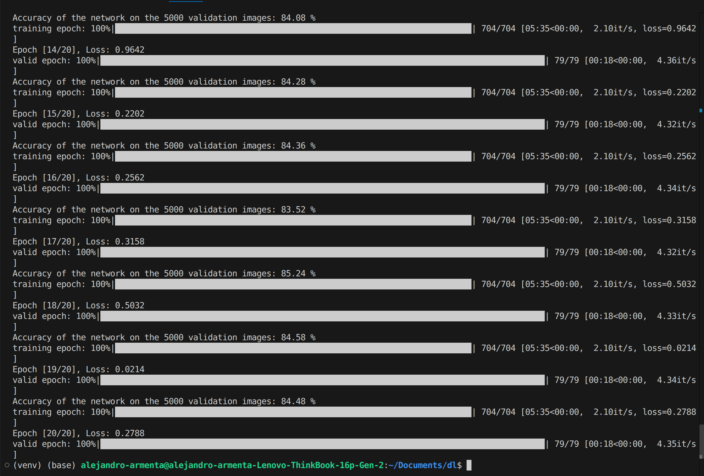
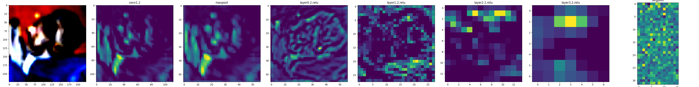

# ResNet 34

This is a ResNet i made from scratch. I used Pytorch and Python to make the neural network.

I trained the model on CIFAR10 to classify images into 10 classes.

I used residual connections to make the model train better.

I used convolutional layers to get features from images.

The architecture is reducing the layer sizes across the model making a pyramid with more layers on each residual block.

The model makes 85% accuracy on validation data.

Here you can look at the feature map from some layers into the model:

